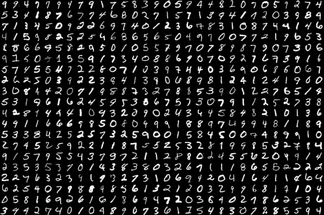
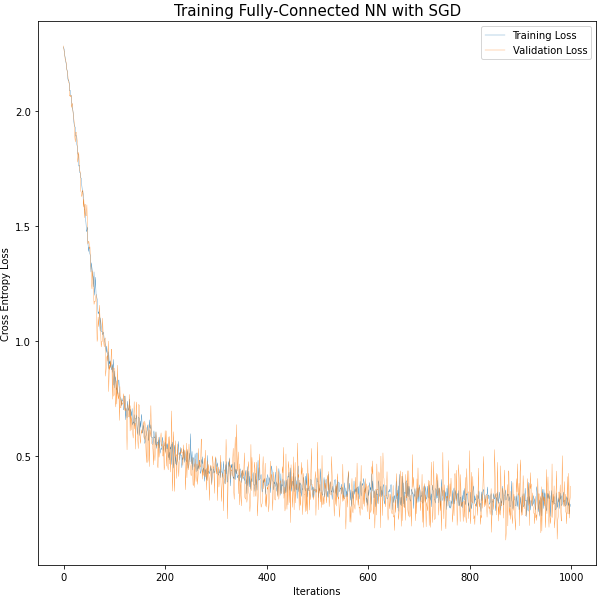
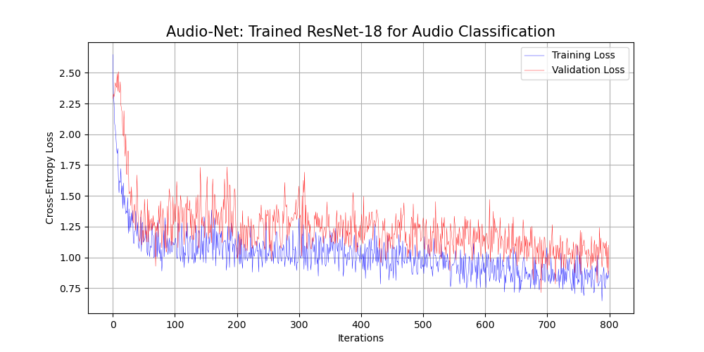
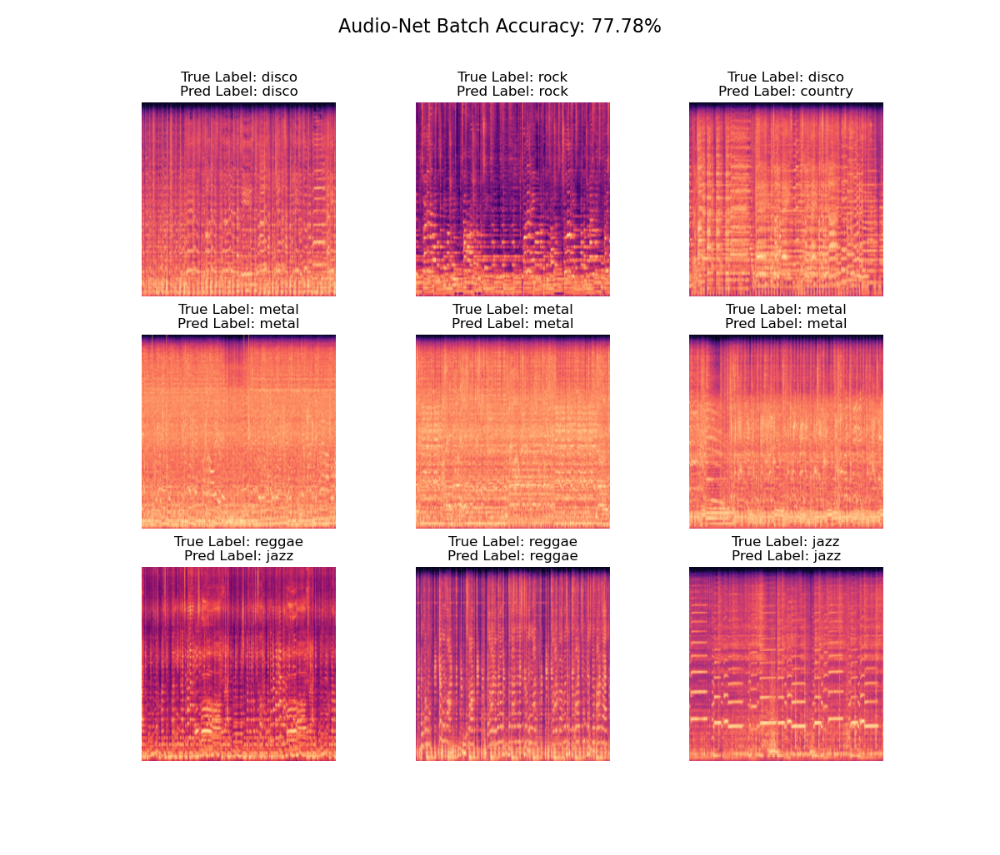
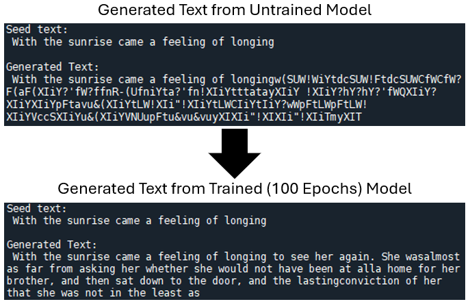
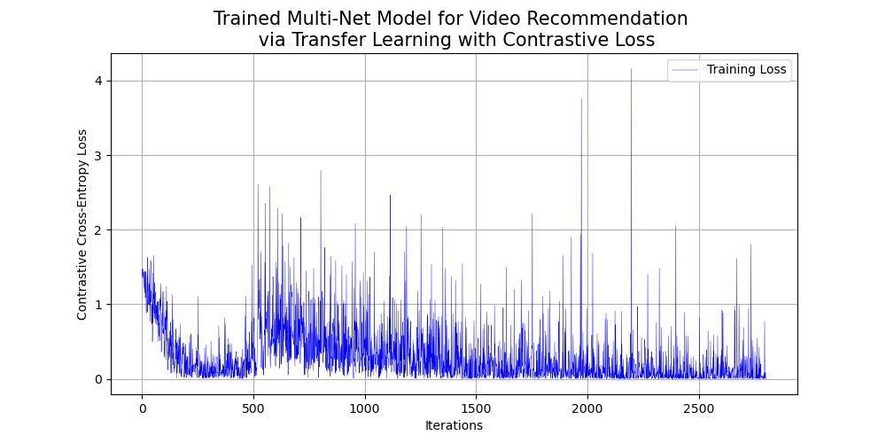

# Introduction to Deep learning

This repository serves as a place where I will keep a portfolio of a variety of different deep learning projects. These projects are meant to serve as reference for working with different types of deep learning models on different types of data (images, audio, text, multi-modal, etc.).

## Table of Contents
1. [Introduction to Deep Learning](#intro)
2. [Austen-Net: Transformer Decoder Language Model for Text Generation](#austen-net)
3. [Lit-Net: Transformer Endoder for Literature Embeddings](#lit-net)
4. [Audio-Net: Audio Classification via Image Recognition](#audio-net)
5. [Multi-Net: Multi-Modal Architectures](#multi-net)
6. [Acknowledgments](#acknowledgments)
7. [License](#license)

## Introduction

## Audio-Net: An Audio Classification Model via Image Recognition

The dataset that was utilized for this project was the well-known [GTZAN music genre classification dataset](https://www.kaggle.com/datasets/andradaolteanu/gtzan-dataset-music-genre-classification?resource=download).

## Austen-Net: A Transformer Decoder Language Model for Text Generation

The dataset consisted of the eight following novels by Jane Austen:
- Persuasion
- Northanger Abbey
- Mansfield Park
- Emma
- Lady Susan
- Love and Friendship and Other Early Works
- Pride and Prejudice
- Sense and Sensibility

## Multi-Net: Multi-Modal Architecture for Video Recommendation
This project consists of building a video recommendation engine using the well-known [MSR-VTT Dataset](https://www.microsoft.com/en-us/research/wp-content/uploads/2016/06/cvpr16.msr-vtt.tmei_-1.pdf). This is accomplished by generating embeddings (where each embedding comes from a pre-trained model that is fine-tuned to this dataset via transfer learning) for each of the modalities and combining them in an early fusion design. The model is then trained via representation learning with a contrastive loss function to pull similar embeddings closer together in the resulting vector space while pushing dissimilar embeddings further apart.

### Video Encoder

### Audio Encoder

### Text Encoder

### Early Fusion Multi-Modal Architecture

## Acknowledgements

## License

