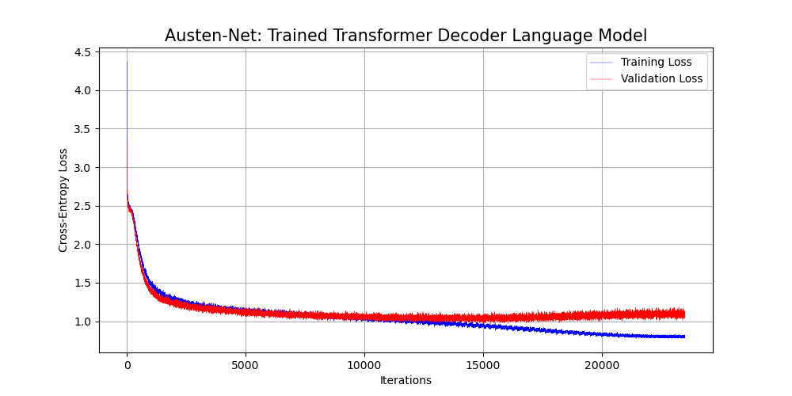

# Introduction to Deep learning

This repository serves as a place where I will keep a portfolio of a variety of different deep learning projects. These projects are meant to serve as reference for working with different types of deep learning models on different types of data (images, audio, text, multi-modal, etc.).

## Table of Contents
1. [Introduction to Deep Learning](#intro)
2. [Austen-Net: Transformer Decoder Language Model for Text Generation](#austen-net)
3. [Lit-Net: Transformer Endoder for Literature Embeddings](#lit-net)
4. [Audio-Net: Audio Classification via Image Recognition](#audio-net)
5. [Multi-Net: Multi-Modal Architectures](#multi-net)
6. [Acknowledgments](#acknowledgments)
7. [License](#license)

## Introduction

## Austen-Net: A Transformer Decoder Language Model for Text Generation

## Lit-Net: A Transformer Endoder for Literature Embeddings

## Audio-Net: An Audio Classification Model via Image Recognition

## Multi-Net: Multi-Modal Architectures

## Acknowledgements

## License

