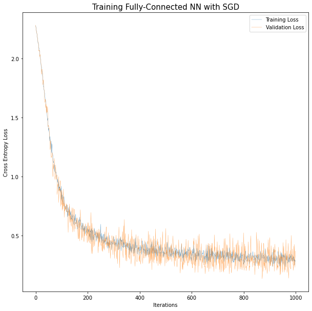

# Introduction to Deep learning with Scikit-Learn and PyTorch

  

## The Goal of this Repository
This repo contains a series of Jupyter notebooks that aim at serving as an introduction to computing with deep neural networks in python.

Some topics that are coverd are:

+ Indrocing image data
+ Introducing Pytorch
+ Defining NNs in sklearn and Pytorch
+ Writing a basic pipeline for training NNs in Pytorch
+ Introducing convolutional neural networks with Pytorch

## Examples

  

