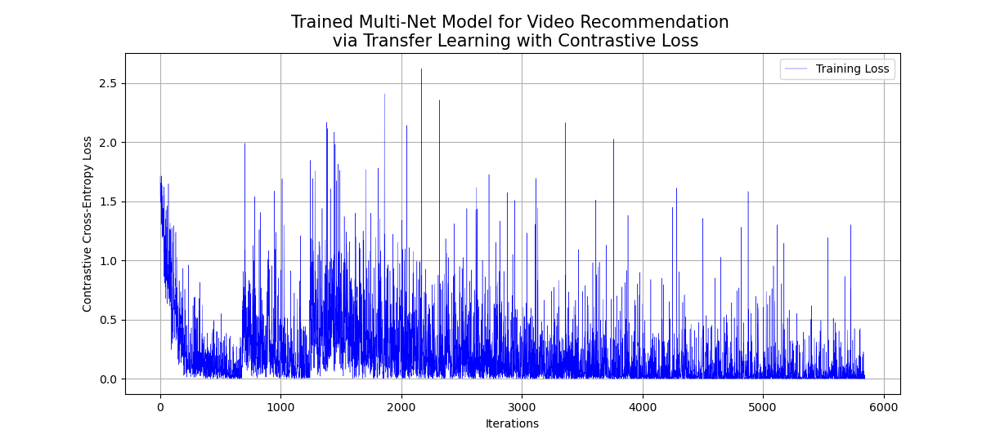

# Introduction to Deep learning

This repository serves as a place where I will keep a portfolio of a variety of different deep learning projects. These projects are meant to serve as references for working with different types of deep learning models on different unstructures data types (images, audio, text, multi-modal, etc.).

## Table of Contents
1. [Introduction to Deep Learning](#intro)
2. [Audio-Net: Audio Classification via Image Recognition](#audio-net)
3. [Austen-Net: Transformer Decoder Language Model for Text Generation](#austen-net)
4. [Multi-Net: Multi-Modal Architectures](#multi-net)
5. [Acknowledgments](#acknowledgments)
6. [License](#license)

## Introduction to Neural Networks with Scikit-Learn and Pytorch
This goal of this project is to serve as a gentle introduction to neural networks (NNs). The code associated with this project is straightforward and is mostly meant to serve as a reference to working with NNs in Scikit-Learn and PyTorch. As such, this project can be split into two parts: (1) NNs with Scikit-Learn and (2) NNs with PyTorch.

The first part of this project starts by implementing a simple multi-layer perceptron (MLP, i.e., a fully-connected feed-forward NN) in Scikit-Learn on a simple tabular Loan Dataset. This consists of importing the dataset, performing simple visualizations and exploratory analysis, followed by training a simple MLPClassifier model in Scikit-Learn. It bears mentioning that none of the NNs in this project are hyper-parameter tuned to perfection, as the project is mainly meant to serve as a reference / introduction to the syntax and process of working with NNs.

The second part of this project focuses on implementing a similar MLP with PyTorch, but now on images (a form of unstructured data). This is accomplished by importing the classic MNIST dataset which consists of images of hand-written digits.

I then introduce code for going about implementing a simple MLP for this dataset along with the algorithm for training the model. Notice that although MNIST is a dataset of images, I only utilize a feed-forward network to start and not a convolutional NN (CNN), which I will incorporate later. The loss of the model can be plotted over the training iterations (and is displayed below).

## Audio-Net: An Audio Classification Model via Image Recognition

The goal of this project is to serve as an introduction to more advanced deep learning techniques that can be applied to solving problems with unstructured data, in this case audio data. 
Specifically, this project aims at training a deep NN to classify different audio samples (a time-dependant sequential data-type) via image recognition. This is accomplished by converting each of the audio wave samples to images of their corresponding mel-scale spectrograms by applying the short-time Fourier-transform (STFT). One can then train a convolutional NN on the resulting spectrogram images, which in this case is accomplished my importing a pre-trained ResNet18 model and fine-tuning it to our dataset via transfer learning.

The dataset that was utilized for this project was the well-known [GTZAN music genre classification dataset](https://www.kaggle.com/datasets/andradaolteanu/gtzan-dataset-music-genre-classification?resource=download), which consists audio wave samples of songs / instruments and where the goal is to propperly classify the music genre of any given audio sample (jazz, metal, disco, rock, etc.).

(Insert image here of raw audio-wave and corresponding spectrogram)

The code provided for this project features a series of different data augmentations that can be applied to the spectrogram images to yeild more training data as well as help the model generalize better. Further, the loss of the model can be plotted over the training iterations (as displayed below) and the training algorithm itself is set-up to plot real-time model improvements.

Once the model has been trained, one can devise any number of evaluation metrics to understand the performance of the model on new data. Below is a simple display of some spectrograms, paired with their true labels and the predicted label. Similar to the first project, the model in this project is has by no means been hyper-parameter tuned to perfection, and performance could certainly be improved by choosing more specialized learning parameters as well as implementing different data augmentations. However, as was seen above, the model is indeed able to learn, which is the only goal of the remaining projects (to have successfully implementable code for training these models; past that, it is a matter of hyper-parameter tuning and throwing more GPUs and training time at it...).

## Austen-Net: A Transformer Decoder Language Model for Text Generation

Large-Language models have take the world by storm ever since OpenAI's ChatGPT (GPT standing for Generative Pre-Trained Transformer) went mainstream in 2022; however, the deep NN architectures under the hood of these models (Transformers) immediately began taking over many diffferent problem domains ever since the release of the seminal paper "Attention is All you Need" in 2017, which proposed the simple-yet-effective idea of the attention operator as well as the general transformer architecture. From the original transformer architecture that was proposed in that paper (which would would now be referred to as an encoder-decoder transformer), several sub-architectures were found to be useful for accomplishing different tasks: (1) the encoder-only transformer and (2) the decoder-only transformer. Encoder-only transformers like BERT (Bidirectional Encoder Representations from Transformers) and its variants (HuBERT, ALBERT, etc.) excel at typical supervised learning classification / regression problems. Alternatively, decoder-only transformers like ChatGPT (Google's Gemini, etc.) excel at next-token prediction tasks for sequential data (earning them the name of "Generative Models" as they are able to "generate" the next token in a sequence). Lastly, Encoder-Decoder transformers like Meta's BART (or Google's T5) excel at sequence-conversion tasks, like translating engligh to spanish, etc.

The goal of this project is to serve as an introduction to utilizing these transformer architectures on a language modeling task. Specifically, the project aims at training a customly-implemented decoder-only transformer to generate infinite text in the style of Jane Austen.

The dataset consisted of the eight following novels by Jane Austen:
- Persuasion
- Northanger Abbey
- Mansfield Park
- Emma
- Lady Susan
- Love and Friendship and Other Early Works
- Pride and Prejudice
- Sense and Sensibility

## Multi-Net: Multi-Modal Architecture for Video Recommendation
This project consists of building a video recommendation engine using the well-known [MSR-VTT Dataset](https://www.microsoft.com/en-us/research/wp-content/uploads/2016/06/cvpr16.msr-vtt.tmei_-1.pdf). This is accomplished by generating embeddings (where each embedding comes from a pre-trained model that is fine-tuned to this dataset via transfer learning) for each of the modalities and combining them in an early fusion design. The model is then trained via representation learning with a contrastive loss function to pull similar embeddings closer together in the resulting vector space while pushing dissimilar embeddings further apart.

### Video Encoder

### Audio Encoder

### Text Encoder

### Early Fusion Multi-Modal Architecture

## Acknowledgements

## License

